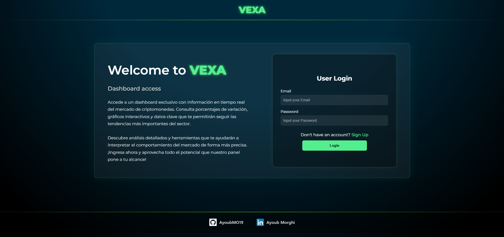
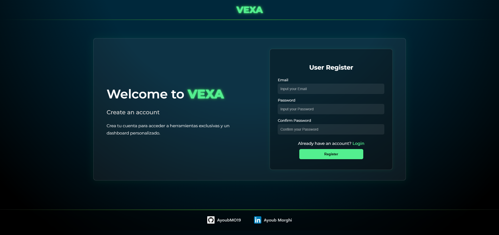
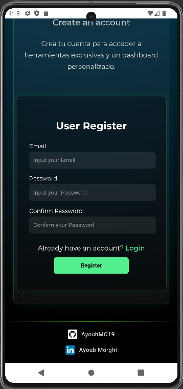
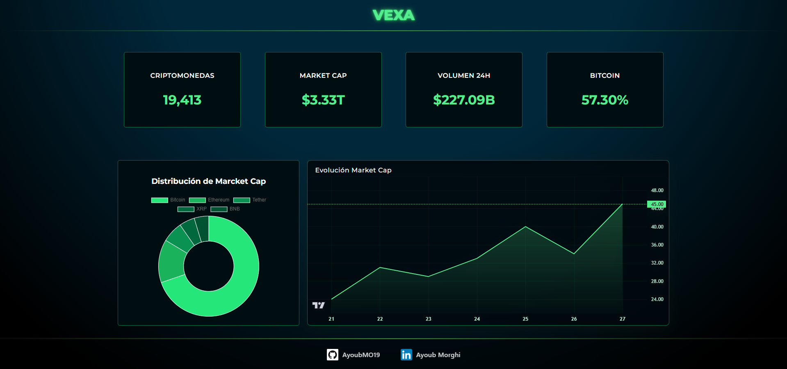
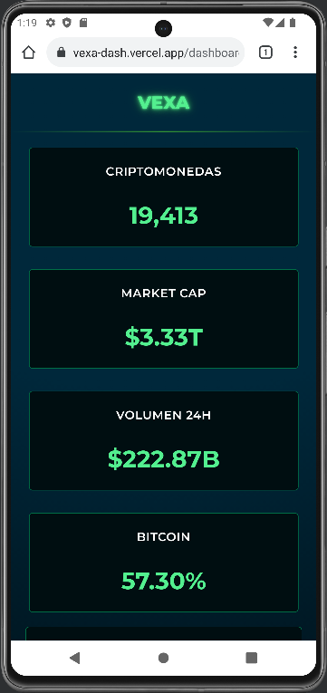

# 🚀 VEXA Dashboard — React + Vite

A modern and minimalist cryptocurrency dashboard built with React + Vite, designed to display real-time market data through a clean, data-driven interface.
It features smooth UI interactions, a custom neon style, and integration with an external Node.js API.

## ✨ Features
- 🔐 Authentication powered by Appwrite
- 📊 Interactive dashboard with dynamic cards and charts
- ⚡ Ultra-fast development with Vite
- 🎨 Custom UI using CSS Modules (neon green + dark theme)
- 🌐 Fetches data from a custom Node.js API
- 📱 Fully responsive layout
- 📈 Lightweight Charts for performant visualizations

## 🛠️ Tech Stack
- React 18
- Vite
- Appwrite Auth
- Lightweight Charts
- CSS Modules
- Node.js REST API
- Vercel (hosting)

##📦 Installation
```
# 1. Clone the repository
git clone https://github.com/YOUR_REPO_HERE.git

# 2. Install dependencies
npm install

# 3. Create your .env file
# Add your APPWRITE_* variables here

# 4. Run in development mode
npm run dev

# 5. Build for production
npm run build
```

## 🗂️ Project Structure
```
.
├── public/                         # Static files
├── src/
│   ├── assets/                     # Images, icons, logos
│   ├── components/
│   │   ├── common/                 # Header, Footer, shared UI
│   │   ├── dashboard/              # Dashboard cards & charts
│   │   └── home/                   # Homepage components
│   ├── pages/
│   │   ├── Dashboard.jsx           # Main dashboard screen
│   │   ├── Dashboard.module.css    # Dashboard styling
│   │   └── Home.jsx                # Landing page
│   ├── services/
│   │   ├── api.js                  # API base configuration
│   │   ├── authService.js          # Login / Register / Logout
│   │   └── coinService.js          # Crypto data service
│   ├── utils/
│   │   └── formatters.js           # Data format helpers
│   ├── App.jsx                     # Global routing
│   ├── Global.module.css           # Global styles (background, fonts)
│   ├── appwrite.js                 # Appwrite client setup
│   └── main.jsx                    # React root render
│
├── eslint.config.js
├── tailwind.config.js              # (optional, used for resets)
├── vercel.json
├── vite.config.js
└── README.md
```

## 🔑 Live Demo
### 🌐 Production URL
  - https://vexa-dash.vercel.app/
### 👤 Test Account
  - email: test@vexa.com
  - password: 12345678

## 🖼️ Screenshots
<p align="center">
  
  
</p>

<p align="center">
  
  
</p>

<p align="center">
  
  
</p>


